# 🎮 KingGame - PlayStation Rental Website

Website rental PlayStation (PS3, PS4, PS5) berbasis **Laravel 13**

---

## 📸 Screenshot Halaman Web

### Landing Page
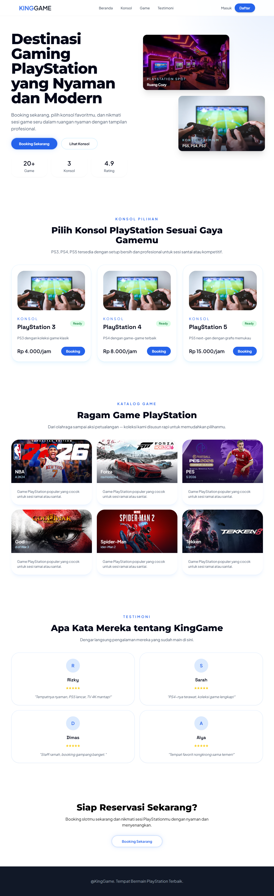

### Login Page
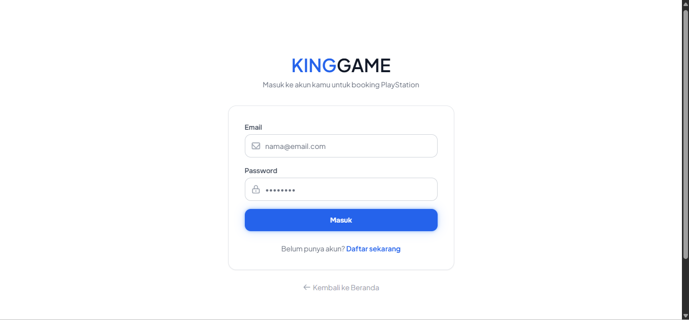

### Register Page
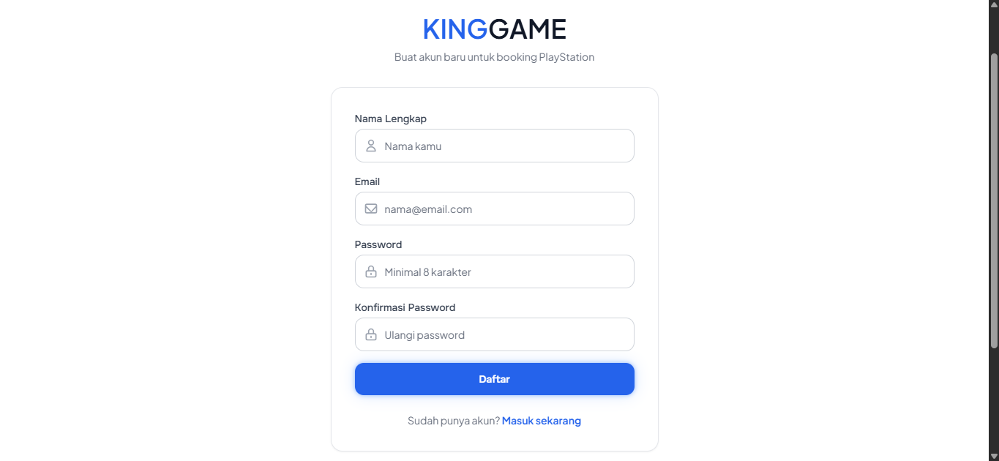

### Dashboard User
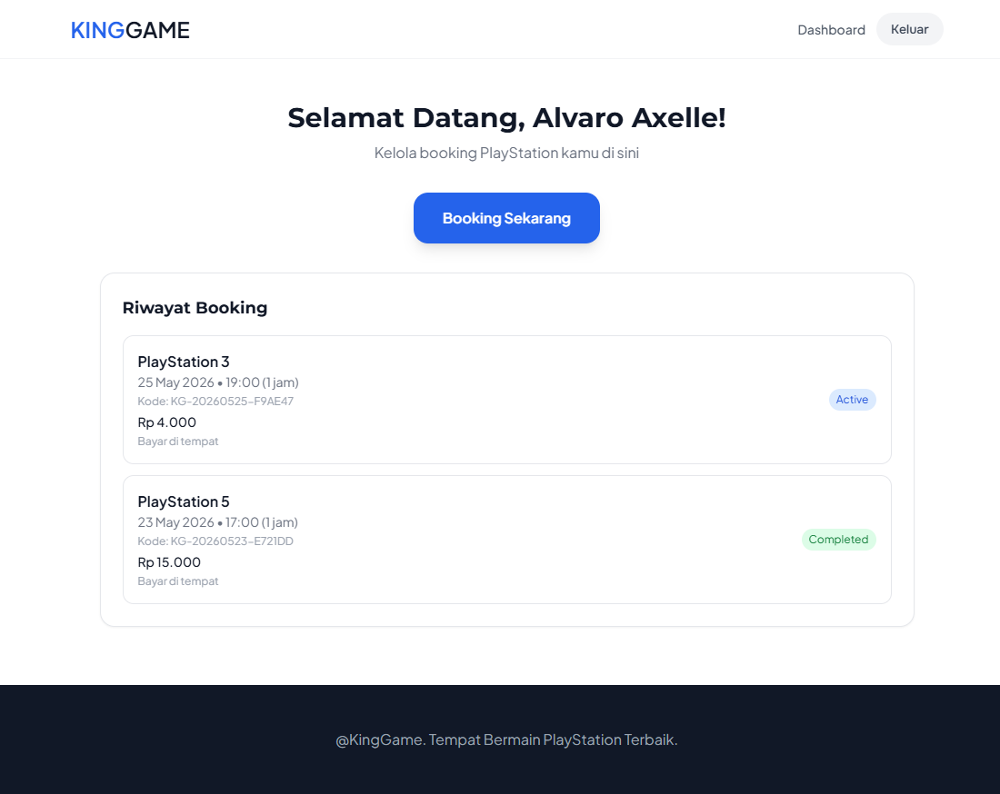

### Choose Booking
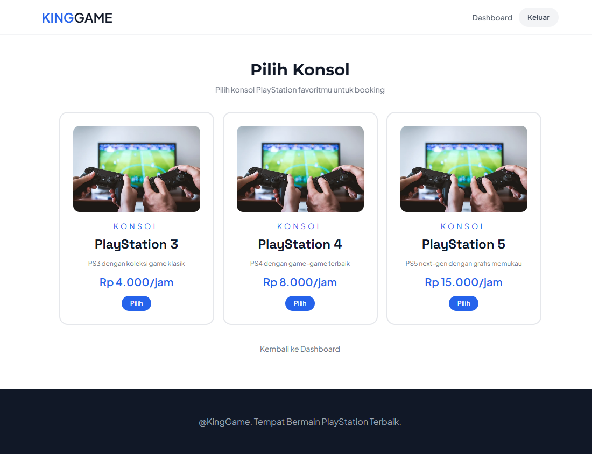

### Form Booking
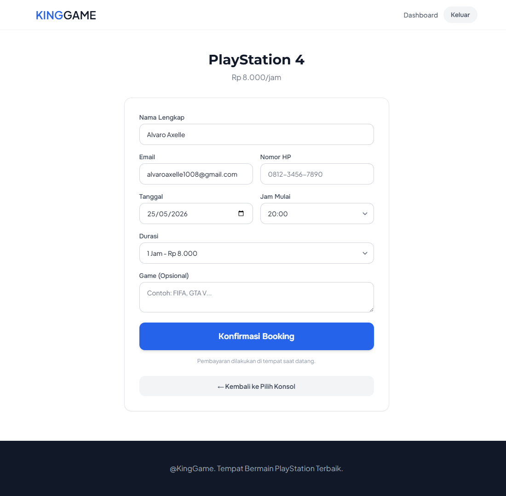

### Admin Dashboard
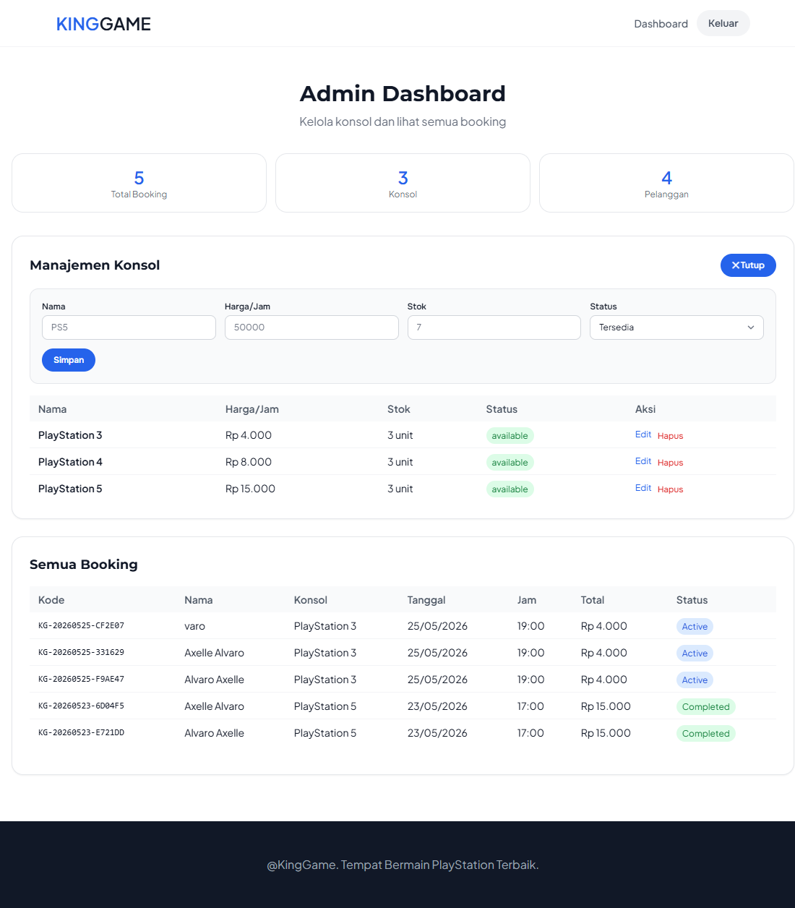

### Admin Edit Console
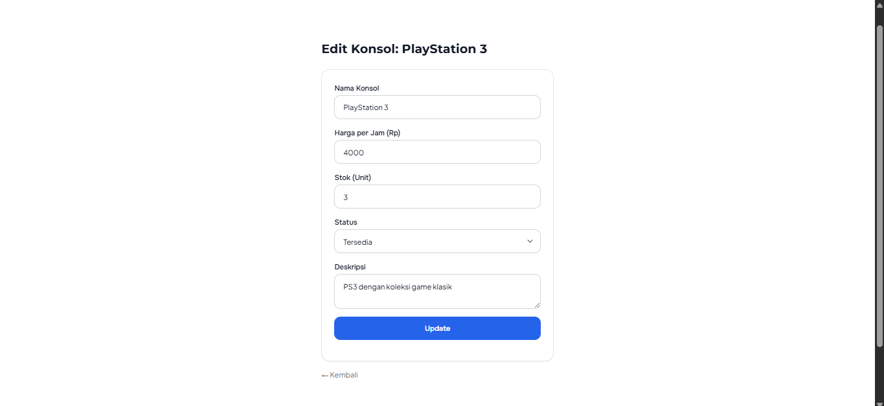
---

## 🗄️ Screenshot Database

### Tabel users
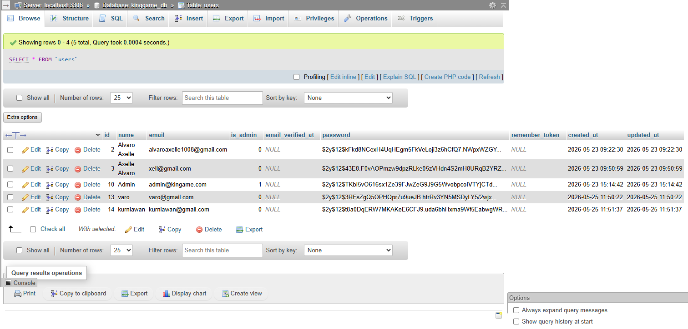

### Tabel devices
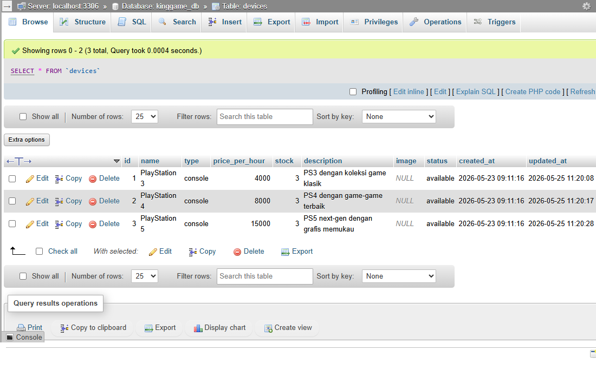

### Tabel bookings
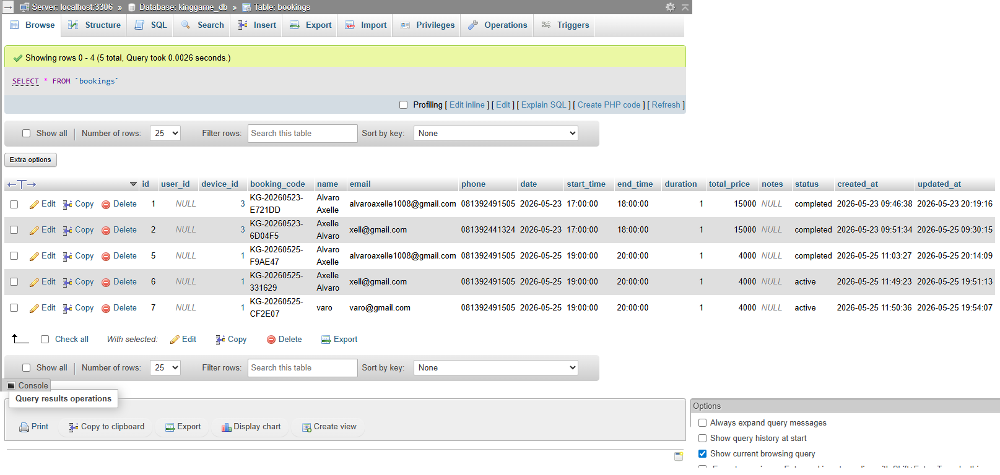

---

## ✨ Fitur Utama

### 👤 User
- Login & Register (Session)
- Dashboard dengan riwayat booking
- Booking konsol (Pilih konsol → Form booking)
- Cancel booking
- Auto-status (pending → active → completed)
- Cek ketersediaan slot real-time
- Responsive (Mobile, Tablet, Desktop)

### 👑 Admin
- Dashboard Admin (Statistik + Manajemen)
- CRUD Konsol (Tambah, Edit, Hapus)
- Lihat semua booking
- Responsive (Mobile, Tablet, Desktop)

---

## 🛠️ Teknologi

| Teknologi | Keterangan |
|-----------|------------|
| Laravel 13 | Backend Framework |
| MySQL | Database |
| Tailwind CSS | Styling |
| Alpine.js | Interaktivitas |
| AOS | Animasi Scroll |
| Carbon | Manipulasi Tanggal |

---
